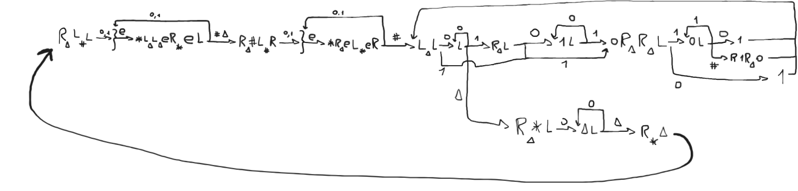
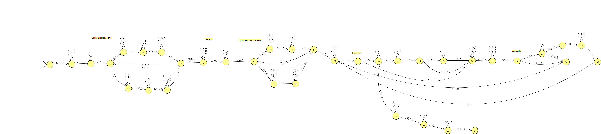

# Simulador de Maquina de Turing

Simulador de máquina de Turing que permite crear máquinas o cargarlas desde archivos con extensión *.csv* y posteriormente ejecutarlas.

Autores:
* Alan Kalevich
* Ramiro Parra

## Implementación

Lo primero que se hizo fue modelar la máquina de Turing que desarrolla en su cinta la sucesión de Fibonacci, donde los numeros estan expresados en binario y separados por '#'.

Luego pasamos ese modelo de máquina de Turing a un autómata para crear la tabla de transición.

## Instalación

1. Clonar el repositorio
`git clone https://github.com/Ramiro1414/TuringFibonacci.git`

2. Cambiar al directorio del repositorio clonado
`cd TuringFibonacci`

3. Crear un nuevo entorno virtual para instalar las librerias necesarias.
`python3 -m venv fundamentos`

4. Activar el entorno virtual.
    Para Linux: `source fundamentos/bin/activate`
    Para Windows: `fundamentos\Scripts\activate`

5. Instalar las dependencias necesarias.
`pip install -r requirements.txt`

6. Ejecutar el programa.
`python3 menu_turing.py`

> [!IMPORTANT]
> Utilizamos algunas convenciones para la implementación de este simulador:
>
> * La cinta por defecto está totalmente vacía (es decir, todas las celdas tienen un espacio).
> * Todas las máquinas que se construyan comienzan en un espacio ('▲') y el contenido se encuentra a su derecha.

> [!TIP]
> Para consultar la documentación haga click 